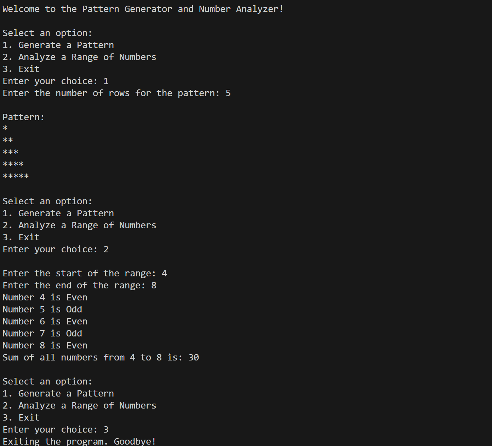

## Pattern Generator and Number Analyzer

This Python program generates a star pattern and analyzes a range of numbers.

### Features

* Generate a star pattern based on the number of rows.
* Check whether numbers are Even or Odd.
* Calculate the sum of numbers in a given range.
* Use a menu-driven program with an exit option.

### Concepts Used

* While Loop
* For Loop
* If-Else Statements
* Range Function
* User Input
* Arithmetic Operators

### Program Output

